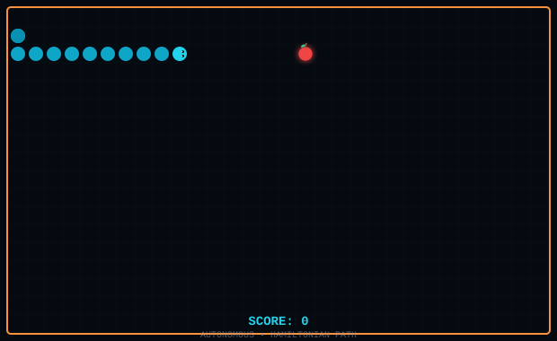

# 👋 Hi, I'm Erhan Emir

🛠️ **Maker & Developer** — Embedded Systems, IoT, Web & Mobile  
📍 Turkey | 🌐 [erhanemir.github.io](https://erhanemir.github.io)

---

### 🐍 Autonomous Snake (live in this README)

  

  🟢 Snake • 🍎 Food • 🧱 Walls • Auto-playing via Hamiltonian path

---

### 🛠️ Tech Stack

| Category | Technologies |
|----------|--------------|
| **Embedded** | C/C++, Arduino, ESP32/ESP8266, LoRa, FreeRTOS |
| **PCB & CAD** | EasyEDA, KiCad, Fusion 360, Tinkercad, 3D Printing |
| **Backend** | Python, FastAPI, Django, Linux, Docker, GitHub Actions |
| **Frontend** | HTML/CSS/JS (vanilla), TypeScript, React (basics) |
| **Mobile** | Dart, Flutter, Cross-platform apps |
| **Tools** | Git, GitHub, VS Code, PlatformIO, KiCad |

---

### 📦 Featured Projects

| Project | Description | Stack |
|---------|-------------|-------|
| **[indir-gitsin](https://github.com/ErhanEmir/indir-gitsin)** | Multi-platform video/image downloader (TikTok, Instagram, YouTube, Pinterest…) | Python, CLI, yt-dlp wrapper |
| **[erhanemir.github.io](https://github.com/ErhanEmir/erhanemir.github.io)** | Personal portfolio — typing animation, terminal, mouse glow, error pages | HTML, CSS, JS (vanilla) |

---

### 📊 GitHub Stats

  
  

---

### 📫 Connect

---

🤖 How the snake works

The snake follows a **Hamiltonian cycle** — a path that visits every cell exactly once before returning to start. This guarantees:
- ✅ Never hits itself
- ✅ Eventually eats every food
- ✅ Runs forever without human input

The SVG is regenerated every 6 hours via GitHub Actions (`.github/workflows/snake.yml`).

